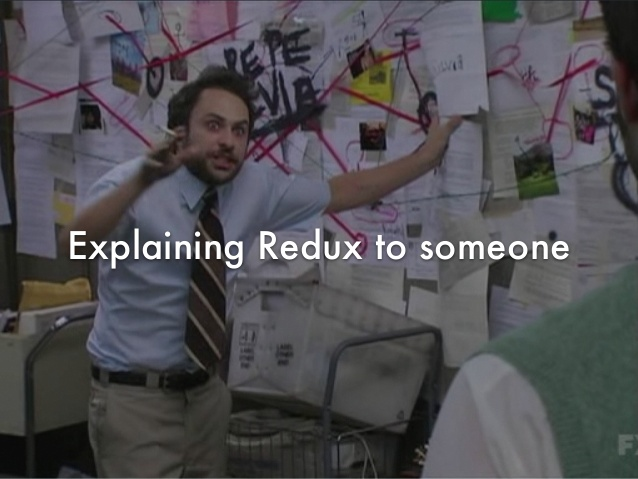

## React / Redux example for my students

In this repo I hope to teach you:

- How to go from using React to React / Redux
- A way to organise your React / Redux project
- The why and how of some React / Redux best practices
- git / github communication

## Dear student,

When I attented ReactConf I saw [this talk](https://www.youtube.com/watch?v=Q54YDGC_t3Y) where the speaker (Kitze) summarised how it feels to explain redux:

I've felt this way while explainging redux. But why?

1. People tend to explain React / Redux and their best practices at the same time.
2. A lot of React / Redux best practices are focused on seperation of concerns, testability & extensibility. This is a different approach from most beginners who just 'Want to make it work'.

## My plan

1. I plan to show you a simple React / Redux example and apply the best practices step by step instead of all at once.
2. I plan to keep a very detailed git history so you can understand how / why the example has evolved over time.

